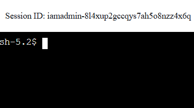

# Welcome to my AWS CloudFormation project

I designed and implemented this project to demonstrate the core AWS services, automation, and secure architecture practices used in modern cloud engineering roles. The goal was to create a production-style environment that could be deployed and torn down entirely with Infrastructure-as-Code, while following cost-efficient and security-first principles.

---

## Core AWS Skills
- **Networking:** Custom VPC, subnets, route tables, and VPC endpoints (no NAT Gateway)
- **Compute:** Private EC2 instance (SSM-only access, no public IP)
- **Database:** Private RDS MySQL instance in dedicated subnets
- **Storage:** S3 bucket for Lambda logs & artifacts, private access only
- **Security:** IAM roles & policies, Security Groups, least-privilege design

## Infrastructure as Code (IaC)
- Modular CloudFormation templates
- Parameterised deployments for project name, environment, and dynamic EC2 alarms

## Automation
- **deploy.ps1** — One-click provisioning of all stacks in correct order
- **cleanup.ps1** — Safe, complete teardown, including:
  - S3 emptying (versioned & non-versioned)
  - Removal of orphaned CloudWatch alarms, SNS topics, and Lambda log groups

## Observability & Alerting
- **CloudWatch Dashboard**: EC2 CPU, RDS DBConnections & FreeableMemory, S3 bucket metrics
- **Dynamic CPU Alarm**: Auto-links to correct EC2 InstanceId after deploy
- **SNS Email Notifications**: Triggered on CPU threshold breach

## Serverless Integration
- Scheduled Lambda logging EC2 instance state to S3

---

## Architecture

flowchart LR
  subgraph VPC["VPC (10.0.0.0/16)"]
    direction TB
    subgraph PrivateAZA["Private Subnet A"]
      EC2[EC2 Instance (no public IP)]
    end
    subgraph PrivateAZB["Private Subnet B"]
      RDS[(RDS MySQL)]
    end
    VPCE1[SSM Interface Endpoint]
    VPCE2[S3 Gateway Endpoint]
  end

  CW[CloudWatch] -->|CPU Alarm| SNS[(SNS Topic)]
  SNS --> Email[Email Subscription]

  Lambda[Lambda (Scheduled)] -->|Logs EC2 State| S3[(Private S3 Bucket)]
  EC2 -. SSM Session Manager .-> VPCE1
  S3 -. Private access via endpoint .- VPCE2

  %% Styles
  classDef vpce fill:#eef,stroke:#88f
  classDef svc fill:#efe,stroke:#5b5

  class VPCE1,VPCE2 vpce
  class CW,Lambda svc

**File Structure**

aws-lumera/
├── README.md                  # This document
├── scripts/
│   ├── deploy.ps1              # Deploys all CloudFormation stacks in correct order
│   ├── cleanup.ps1             # Complete teardown with S3 emptying & orphan cleanup
├── templates/
│   ├── vpc.yml                 # VPC, subnets, route tables, endpoints
│   ├── s3.yml                  # Private S3 bucket for logs & artifacts
│   ├── iam.yml                 # IAM roles, policies for EC2, Lambda, SSM
│   ├── ec2.yml                 # EC2 instance in private subnet (SSM-only access)
│   ├── rds.yml                 # RDS MySQL in private subnets
│   ├── lambda.yml              # Scheduled Lambda to log EC2 state to S3
│   ├── cloudwatch.yml          # Dynamic CPU alarm linked to EC2 by tag
│   ├── dashboard.yml           # CloudWatch dashboard for EC2, RDS, S3 metrics
│   ├── sns.yml                 # SNS topic & email subscription for alarms
├── lambda/
│   └── ec2_status_logger.py    # Lambda function for EC2 state logging

---

**Prerequisites**

AWS account with permissions to create:
VPC, EC2, RDS, IAM, S3, Lambda, SNS, CloudWatch, VPC Endpoints

Region: eu-west-2

Installed tools:
AWS CLI
PowerShell 7
AWSPowerShell modules
Git
VS Code

**Deployment (Windows / PowerShell)**

1. Configure AWS CLI credentials (default region: eu-west-2)
aws configure
2. Deploy the full environment
./scripts/deploy.ps1 -Region eu-west-2 -ProjectName lumera-demo -Environment dev
3. Confirm the SNS subscription via the email you receive

**Testing the Alarm Path**

Generate CPU load on the EC2 instance (via SSM Session Manager), or temporarily lower the alarm threshold.

Observe the CloudWatch alarm transition: OK → ALARM → OK

Confirm you receive an SNS email notification.

**Teardown**

./scripts/cleanup.ps1 -Region eu-west-2 -ProjectName lumera-demo -Environment dev

Deletes stacks in dependency order
Empties S3 buckets (handles versioned objects)
Removes orphan CloudWatch alarms, SNS topics, and Lambda log groups

**Notes**

No NAT Gateway — secure private-only architecture using VPC endpoints.
EC2 is accessed exclusively through SSM Session Manager.
Alarms auto-link to the correct EC2 InstanceId after deploy.
CloudWatch dashboard gives a one-glance health view of compute, database, and storage.
Full lifecycle workflow supported: deploy → operate → teardown.

---

**Result**

This project delivers a secure, private-only AWS environment with full lifecycle automation, observability, and cost-conscious design. It shows the ability to combine networking, compute, database, serverless, and monitoring into a cohesive, production-ready stack

**Screenshots**
Deploy

Dashboard

SSM Terminal

SSM AWS Console

Email Alarm

